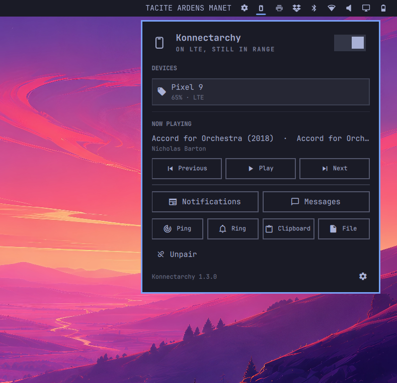

# Konnectarchy

Pair a phone to the Omarchy bar over the KDE Connect protocol. Notifications, SMS, media, ping, ring, clipboard, and file share live in the panel. Pairing still uses `kdeconnectd`.



## Install

```sh
omarchy plugin add https://github.com/astorrer/konnectarchy.git --enable
```

Click **Install Konnectarchy** in the panel. That installs `kdeconnect`, opens TCP/UDP `1714–1764` if `ufw` is active, and starts the daemon.

On the phone, install **KDE Connect**, join the same Wi-Fi, and pair from the panel.

For names in SMS: KDE Connect → this computer → **Contacts**. Grant permission and allow copying the address book.

## Use

- Left click opens the panel. Right click refreshes. Middle click pings the phone.
- Click the phone in the panel to open the KDE Connect app.
- Picture messages show a thumbnail; other attachments show as a chip.
- New message looks up names from synced contacts. You can still type a number.
- 2FA codes and http(s) links get a copy chip. They are copied, never opened.
- Notifications, messages, ping, ring, clipboard, and file share are in the panel.
- When the phone is playing something, Now playing shows the track with previous, play/pause, and next. It hides when idle.
- Desktop popups from KDE Connect still appear. The panel keeps the ones that are still on the phone.

Keys inside the panel:

- Arrows or `h` `j` `k` `l` move the highlight, including left/right on the button pad.
- Enter activates. Esc goes back.
- `n` notifications · `m` messages · `d` dismiss · `y` copy code or link · `p` ping · `f` ring · `c` clipboard · `s` send file · `t` play/pause · `[` previous · `]` next · `r` refresh · `,` settings

The version in the footer opens the project page.

## Settings

Open from the gear in the panel:

- Refresh interval
- Hide when away
- Badge the bar
- Hide SMS notices (on by default)

## Remove

```sh
omarchy plugin remove io.github.astorrer.konnectarchy
```

That only removes the plugin. To drop the autostart file this plugin wrote:

```sh
~/.config/omarchy/plugins/io.github.astorrer.konnectarchy/setup.sh uninstall
```

The `kdeconnect` package, any ufw rules, and synced contacts stay unless you remove them yourself.
